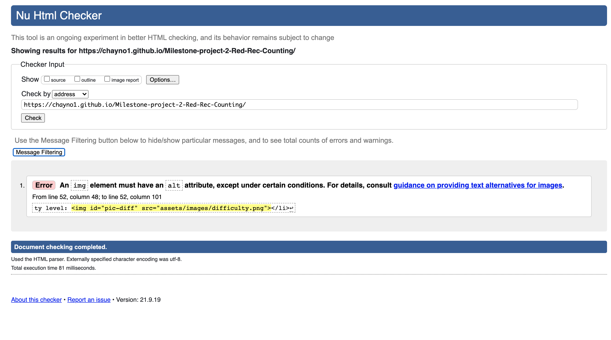
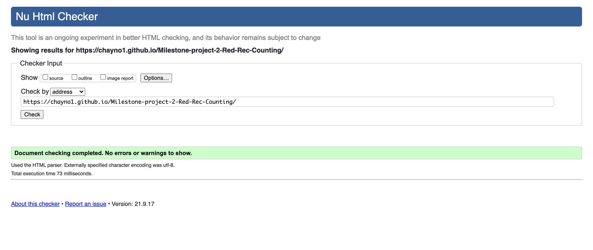
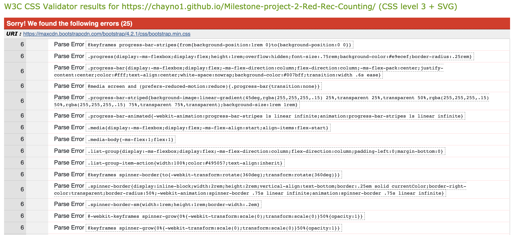
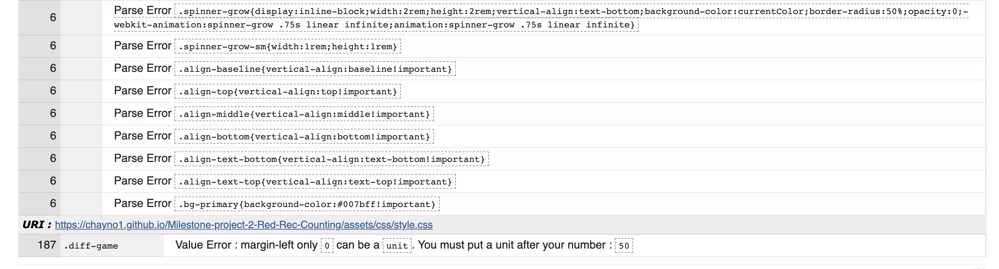
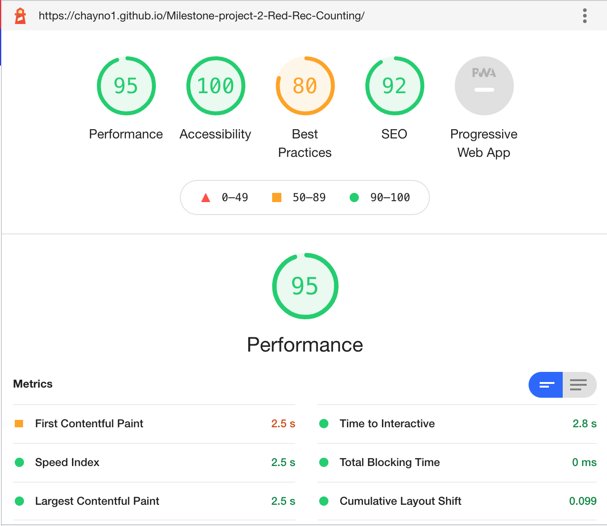
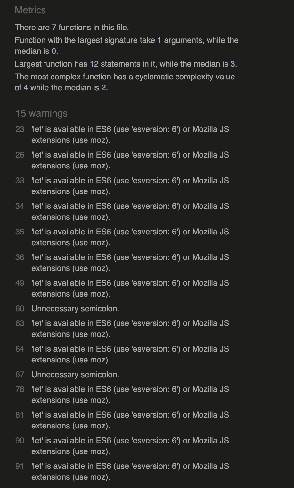

# Milestone-project-2-Red-Rec-Counting

## Contents

 ## Project Aims
 

 
click to expand

 * ### [1.who is this for and why they need a website](#who-is-this-for-and-why-they-need-a-website)
 * ### [2.project aim](##-PROJECT-AIM)
 * ### [3.website needs](#website-needs)
 * ### [4.website design needs](#website-design-needs)
 * ### [5.user needs](#user-needs)
 

 ## Design Choices
 

 
click to expand

 * ### [6.Action Plan](#action-plan)
 * ### [7.wedsite design choices](#website-design-choices)
 * ### [8.website navigation](#website-navigation)
 * ### [9.website main body](#website-main-body)
 * ### [10.website colours](#website-colours)
 * ### [11.font family](#font-family)
 * ### [12.wireframes, sketched layout](#wireframes,-sketched-layout)
 

 ## Website Build
 

 
click to expand

  * ### [13.design changes](#design-changes)
  * ### [14.code structure](#code-structure)
  * ### [15.code bugs/fixes](#code-bugs/fixes)
   

 ## Final Website
 

 
click to expand

  * ### [16.final product](#final-product)
  * ### [17.references](#References/-Credits)
   

 ## Evaluations
 

 
click to expand

 * ### [18.Deployment](#deployment)
 * ### [19.Test Website](#test-website)
 * ### [20.Project Objectives test](#project-objectives-test)
 * ### [21.Website Build Test](#website-build-test)
 * ### [22.Overall Test Conclusion](#overall-test-conclusion)
 * ### [23.Future changes/ add ons](#future-changes/-add-ons)
  

## The Strategy
## WHO IS THIS FOR AND WHY THEY NEED A WEBSITE

This is for anyone who wants to take a break, short time filling distraction that is fun, easy to operate and understand.
The game should be fun but challenging giving the user the opportunity to select how hard or easy they wish the game to be.

## PROJECT AIM 

The aim of the project is to build a website that provides a simple, fun, quick, interactive, challenging game for the user.

## WEBSITE NEEDS (business needs)

- To explain how the game works to the user

- To provide a quick easily repeatable game

- Content to be atarctive and interesting

- The game needs to simple enough that anyone can understand the how it works quickly 

- The game needs different levels of challenges, to cater for everyone and to suit the current mood of the user.

## WEBSITE DESIGN NEEDS

- Website needs to fun and friendly

- simple and quick to navigate

- Simple and easy to use

- Explain how the website works effectively

- website will be built with HTML,CSS and JavaScript

## USER NEEDS 

- How the game works

- How to start the game 

- How to make the game easier or harder depending on ability or mood

- Understand what is going to happen when the game starts

- A certain amount of joy and satisfaction from playing the game

## ACTION PLAN

To achieve the aim of the project I'm going to design a website consisting of 2 pages, a home page and a game page.

### The Home Page

- The Home page will be the main opening page of the site, it will contain an introduction to the game and instructions on how to play, as well as links to the game itself.

### The Game Page 

- The game page will dedicated to the game itself, this will be where the user plays the game

## [Back to top](#contents)

## WEBSITE DESIGN CHOICES

### Website Navigation

- To help visitors move between the pages I'm going to input a navbar. This will sit in the header of main body of the page. 
To keep the website simple and easy to use I'm going to have the same header on both pages of the site. This will help visitors intuitively understand how to move around the website.

- The header will consist of the name of the website/game and navbar.

### Website Main body

- This is the area where the main content as described in the action plan will sit on each page.

### colours 

- I have choosen to use a combination of 6 basic colours for the website, using multi-coloured text to make the page more fun and appealling. The six colours are:

- red 
- green
- blue
- gold
- orange 
- purple

- Because of my choice to use multi-coloured text, the main page background is going to be left white.

### Font Family 

- The font choosen for the website is Fredoka with cursive backup from google fonts :https://fonts.google.com/specimen/Fredoka+One?query=Fredoka+One+

- The font was choosen as it is stylish but still clear and easily readable. To keep the flow and look of the website simple but stylish the same font is used throughout the site.
 

## WIREFRAMES, SKETCHED LAYOUT

- Main home page layout -

- Game page layout -

### [Back to top](#contents)

 

## DESIGN CHANGES 

Creating the website the wireframes sketched layout was used as a guide to the overall look of the website.

### Site Navigation

- The navbar was made using bootstrap v5.0.1 

- The navbar now runs across the whole screen below header image for better aestthetics.

### [Back to top](#contents)

 

## CODE STRUCTURE

Folders 

index.html -----------contains html for home page

Game.html-------------contains html for the game page

assets---------------- contains folders css,images,js

css-------------------contains style.css-----all CSS styling for website

js--------------------contains script.js-----all the Javascript code for the website

images----------------contains images used on website and design images folder

design-images---------contains images used in README.md

 css ------------------ contains style.css ---- all CSS styling for website
             
 design-images -------- contains all images used in README.md

### CSS
 - font family for website
 - header
 - navbar 
 - game page body
 - game squares
 - game buttons
 - scores
 - body index.html
 - index.html pictures
 
 ### JavaScript

 - document loaded
 - Start Buttton
 - Color Change and red count function
 - Main game operations
 - Answer Functions

## CODE BUGS/FIXES

- Struggled to get color change to work in js and struggled to calculate red rectangles in Javascript

- Found soulution by counting red rectangles with in the color change function. 

#### Issues not fixed

- media queries/ screen sizes not set.

## FINAL PRODUCT

### Main page top

### Main page bottom

### Game Page

## References/ Credits 

#### Bootstrap v5.0.1

In building the website I used bootstrap v5.0.1 I used this for

 
click to expand

* https://getbootstrap.com/docs/5.0/getting-started/introduction/
* Page layout for gallery.html and about.html
*  Creating the Navbar, https://getbootstrap.com/docs/5.0/components/navbar/
* 
*  collapsing navbar which needed bootstrap javascript code

  

#### Font Family
- The font 'Fredoka' was obtained from google fonts - https://fonts.google.com/specimen/Fredoka+One?query=Fredoka+One+

#### Markdowncollapsible section
- I got the code for the markdown collapsible section from -
https://gist.github.com/pierrejoubert73/902cc94d79424356a8d20be2b382e1ab

### [Back to top](#contents)

## Evaluation

### Deployment

My website is deployed on github pages -  https://chayno1.github.io/Milestone-project-2-Red-Rec-Counting/

How I deployed -

1. Signed in on Github.com
2. opened up my repository Milestone-project-2-Red-Rec-Counting
3. opened settings and clicked on pages
4. In pages clicked on source and changed from none to main then saved.
5. opened live url to check website.
6. made minor changes to image links as background links didnt intially load.
7. Rechecked live url and proceeded to test website.

## Evaluation 

### Test Website

- To evaluate and test my project I broke the testing down into three categories;
- Project objective test
- Website Build test
- Website function test

#### Project objective test

- This part of the test is about testing the websites ability to meet the aims intially set out for the project. This includes
  website business needs, design needs, user needs and project aim.

##### Website business needs

 - To explain the type of website it is

- To explain how to play the game

- make the game easily accessible

- A way for anyone visiting to play 

- give the opportunity to count success or failure of the game

Evaluation : The website covers all 5 points on business needs, 
- The main page is clear in presenting an online game
- Clear instructions are provide on the main page with images to showcase what to look for.
- The website is only made of two pages making access to start the game only a click away.
- Several links to the game page are provide on the home page(about) which are easily accessible
- The game tallies up the result of each game so the user can keep track of their score.

Conclusion : The website achieves the busines needs to a basic level

##### Website design needs

- Website site needs to attractive and interesting

- fun and entertaining

- Simple and easy to use

- website will be built with HTML,CSS,JavaScript

Evaluation : The website covers all 4 points on design needs,
- website is bright and colourful attracting attenion
- The website site is clear and simple to use, content only on two pages making it quick fo the user to navigate
- The game is bright,interactive and random, making it moderately fun and entertaining
- the website was built with HTML,CSS and JavaScript

Conclusion: The website achieves the goals of design needs to a basic level, However the game could be more entertaining

####  website user needs 

- What website they are on, and what service it is providing.

- quickly establish where to find the information they are looking for.

- Quickly get playing the game

- To play the game without any issues with in the game

Evaluation : 

Conclusion: All the goals are achieved to a basic level.  

####  project aim

Conclusion: Website works as expected. All functions work as expected, alerts pop ups as when expected.

### [Back to top](#contents)

#### Website Build Test

  - This part of the test is about testing the websites links, coding and background structure. This includes testing html coding, css styling, css layout, file layout and organisation.

  #### website links, responsive design,deployment
 
 Evaluation : After deploying the website I first checked that each page loaded properly which was successful after some minor adjustments image file links. I then tested the responsive design by changeing the screen size and observing how the website reacted, in which the website changed as designed apart from minor issue referenced in the [code bugs/fixes](#code-bugs/fixes).
 Next I checked all the links, the navbar links to all the pages, the footer links, social media links and main body links. I made sure that all links on all pages worked correctly and went to the correct location, also whether they opened in a new tab or changed the page as set in the coding. The website passed all these tests.

Conclusion : The frontend of the website is operating and presenting correctly as designed in the coding, no issues with overall interaction.

#### html, css, file organisation

file organisation :
I kept the images separate into 2 different categories design-images, images. The design-images folder is for all images used in the README.md, images folder is for all images used on the website. The style.css is contained in the CSS folder and the script.js is contained in the js folder. All three folders CSS,JS,images folders are contained in one folder called assets.

html : To test my html coding first I went through each page checking for any obvious mistakes I could notice myself. I then put my code through a coder validator at https://validator.w3.org/ , results displayed below :

 

CSS : To test my css code I again went through my style.css sheet and visually looked for any obvious errors I noticed. I then put my code through an online css validator at https://jigsaw.w3.org/css-validator/ . This did flag up loads of minor errors, however I was unable to interpret what the results were indicating as the error code was not in my css file. My conclusion is the errors were to do with background code from the bootstrap classes I used on my website, also possibly the verison of bootstrap being used. As my course is not yet complete I'm unable to act at this time till I learn more about different codes. Results displayed below:

 
 lighthouse: An additional test I performed was with lighthouse in google chrome developers tools. I ran this test to get an overall read out of how my website was performing, results below :

 

 #### Website Function Test

 - To test the function of the website I played the game and used the website in a number of different ways to test the response and how well the interaction worked between user and website. In this I checked all possible user options and made sure the website was functional.

 - To test the JavaScript I put the JavaScript code through a JavaScript checker JSHint.com. Although it had 15 warnings, the code had no major faults. At this point the 15 warnings were not fully understood, they suggest a better use of code is possible.

 

### Overall Test Conclusion

Based on all the testing I have performed on the website I feel the site functions well at a basic level achieving the project aims.

## Future changes/ add ons 

To improve and better exceed on project aims, these are future acts I would take on improving this website

#### Fix Issues

- Add media queries so the website functions properly on all size screens.

#### new features

- Footer, I would add a footer with social media links or other business infomation for the user to link to.

- add more complexicity to the game itself, for example create a a round of 10 games and scoring out of 10 instead of 1 game at a time.

### [Back to top](#contents)

