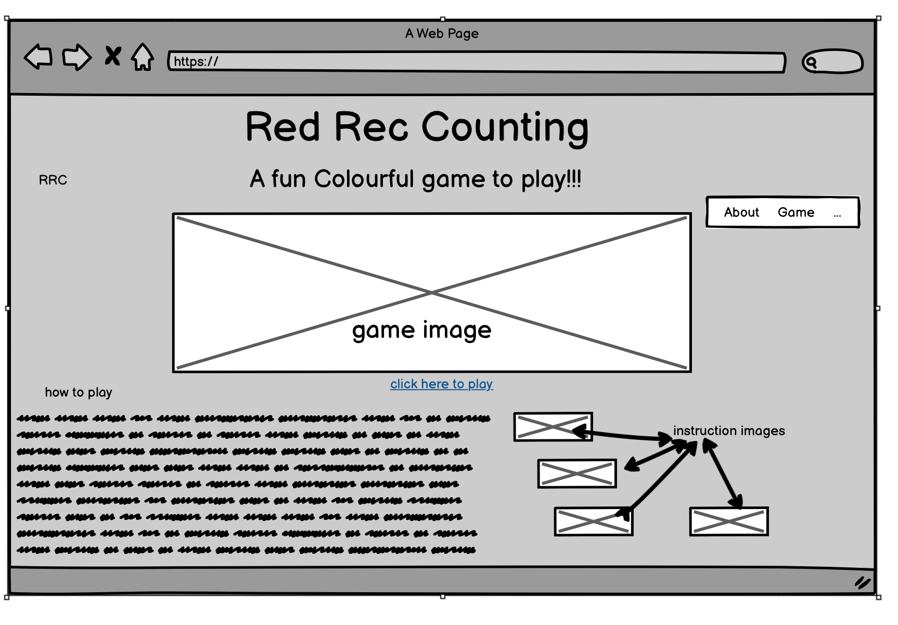
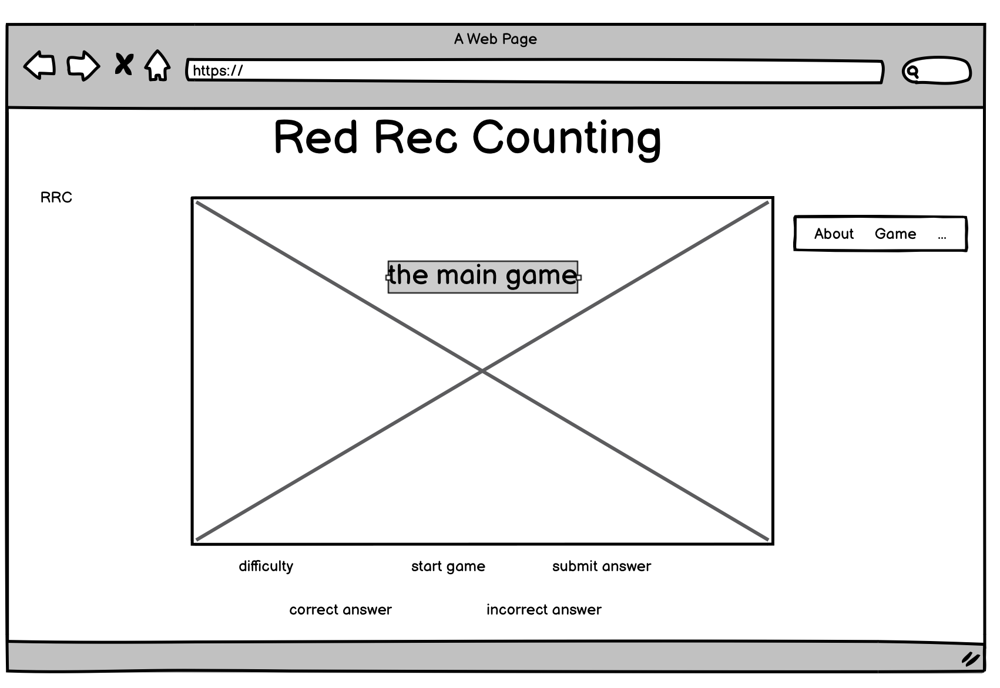
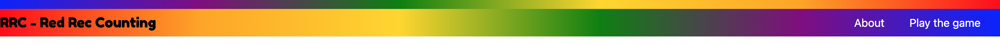
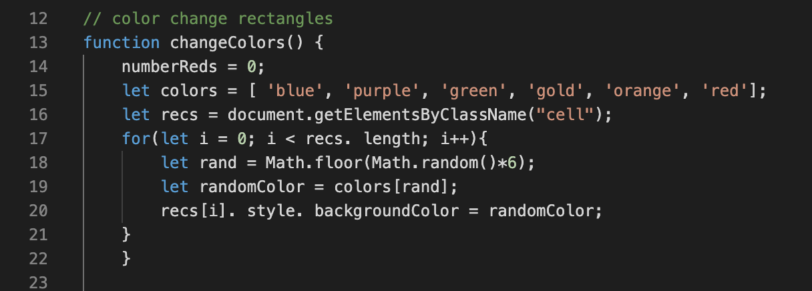
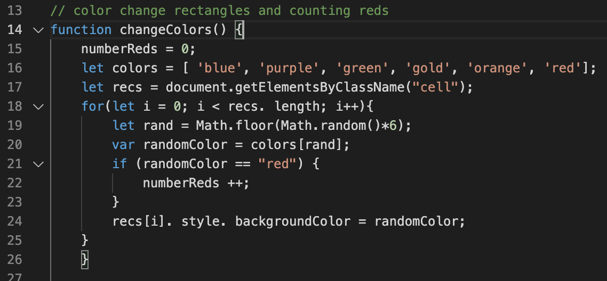
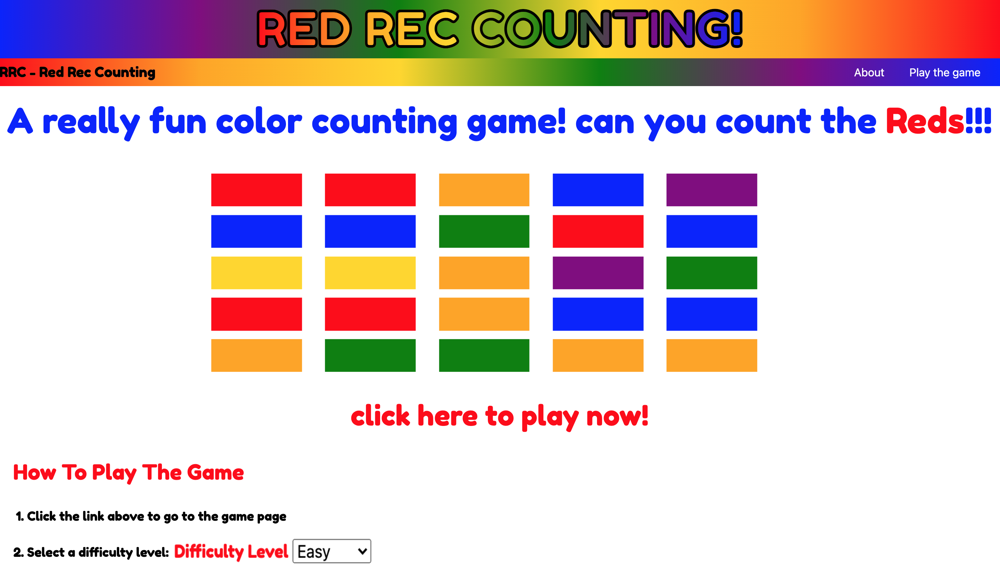
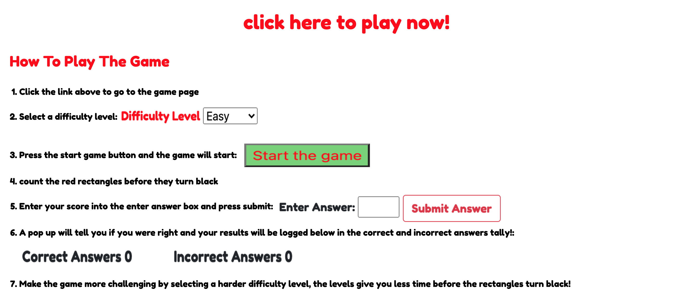
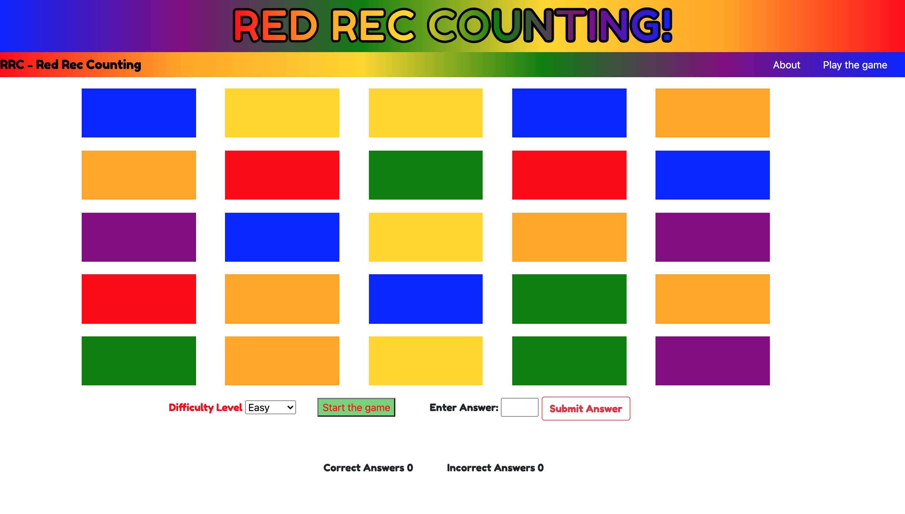
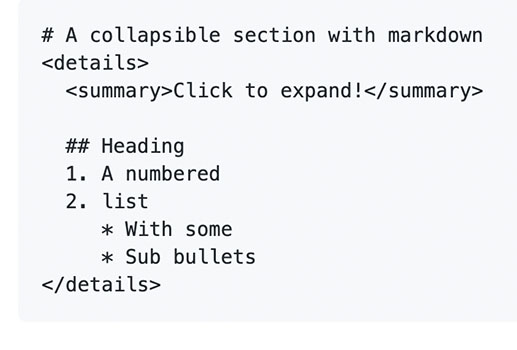

# Milestone-project-2-Red-Rec-Counting

## Contents

 ## Project Aims
 

 
click to expand

 * ### [1.who is this for and why they need a website](#who-is-this-for-and-why-they-need-a-website)
 * ### [2.project aim](##-PROJECT-AIM)
 * ### [3.website needs](#website-needs)
 * ### [4.website design needs](#website-design-needs)
 * ### [5.user needs](#user-needs)
 

 ## Design Choices
 

 
click to expand

 * ### [6.Action Plan](#action-plan)
 * ### [7.wedsite design choices](#website-design-choices)
 * ### [8.website navigation](#website-navigation)
 * ### [9.website main body](#website-main-body)
 * ### [10.website colours](#website-colours)
 * ### [11.font family](#font-family)
 * ### [12.wireframes, sketched layout](#wireframes,-sketched-layout)
 

 ## Website Build
 

 
click to expand

  * ### [13.design changes](#design-changes)
  * ### [14.code structure](#code-structure)
  * ### [15.code bugs/fixes](#code-bugs/fixes)
   

 ## Final Website
 

 
click to expand

  * ### [16.final product](#final-product)
  * ### [17.references](#References/-Credits)
   

 ## Evaluations
 

 
click to expand

 * ### [18.Deployment](#deployment)
 * ### [19.Test Website](#test-website)
 * ### [20.Project Objectives test](#project-objectives-test)
 * ### [21.Website Build Test](#website-build-test)
 * ### [22.Overall Test Conclusion](#overall-test-conclusion)
 * ### [23.Future changes/ add ons](#future-changes/-add-ons)
  

## The Strategy
## WHO IS THIS FOR AND WHY THEY NEED A WEBSITE

This is for anyone who wants to take a break, short time filling distraction that is fun, easy to operate and understand.
The game should be fun but challenging giving the user the opportunity to select how hard or easy they wish the game to be.

## PROJECT AIM 

The aim of the project is to build a website that provides a simple, fun, quick, interactive, challenging game for the user.

## WEBSITE NEEDS (business needs)

- To explain how the game works to the user

- To provide a quick easily repeatable game

- Content to be atarctive and interesting

- The game needs to simple enough that anyone can understand the how it works quickly 

- The game needs different levels of challenges, to cater for everyone and to suit the current mood of the user.

## WEBSITE DESIGN NEEDS

- Website needs to fun and friendly

- simple and quick to navigate

- Simple and easy to use

- Explain how the website works effectively

- website will be built with HTML,CSS and JavaScript

## USER NEEDS 

- How the game works

- How to start the game 

- How to make the game easier or harder depending on ability or mood

- Understand what is going to happen when the game starts

- A certain amount of joy and satisfaction from playing the game

## ACTION PLAN

To achieve the aim of the project I'm going to design a website consisting of 2 pages, a home page and a game page.

### The Home Page

- The Home page will be the main opening page of the site, it will contain an introduction to the game and instructions on how to play, as well as links to the game itself.

### The Game Page 

- The game page will dedicated to the game itself, this will be where the user plays the game

## [Back to top](#contents)

## WEBSITE DESIGN CHOICES

### Website Navigation

- To help visitors move between the pages I'm going to input a navbar. This will sit in the header of main body of the page. 
To keep the website simple and easy to use I'm going to have the same header on both pages of the site. This will help visitors intuitively understand how to move around the website.

- The header will consist of the name of the website/game and navbar.

### Website Main body

- This is the area where the main content as described in the action plan will sit on each page.

### colours 

- I have choosen to use a combination of 6 basic colours for the website, using multi-coloured text to make the page more fun and appealling. The six colours are:

- red 
- green
- blue
- gold
- orange 
- purple

- Because of my choice to use multi-coloured text, the main page background is going to be left white.

### Font Family 

- The font choosen for the website is Fredoka with cursive backup from google fonts :https://fonts.google.com/specimen/Fredoka+One?query=Fredoka+One+

- The font was choosen as it is stylish but still clear and easily readable. To keep the flow and look of the website simple but stylish the same font is used throughout the site.
 

## WIREFRAMES, SKETCHED LAYOUT

- Main home page layout -

- Game page layout -

### [Back to top](#contents)

 

## DESIGN CHANGES 

Creating the website the wireframes sketched layout was used as a guide to the overall look of the website.

### Site Navigation

- The navbar was made using bootstrap v5.0.1 

- The navbar now runs across the whole screen below header image for better aestthetics.

### [Back to top](#contents)

 

## CODE STRUCTURE

Folders 

index.html -----------contains html for home page

Game.html-------------contains html for the game page

assets---------------- contains folders css,images,js

css-------------------contains style.css-----all CSS styling for website

js--------------------contains script.js-----all the Javascript code for the website

images----------------contains images used on website and design images folder

design-images---------contains images used in README.md

 css ------------------ contains style.css ---- all CSS styling for website
             
 design-images -------- contains all images used in README.md

### CSS
 - font family for website
 - header
 - navbar 
 - game page body
 - game squares
 - game buttons
 - scores
 - body index.html
 - index.html pictures
 
 ### JavaScript

 - document loaded
 - Start Buttton
 - Color Change and red count function
 - Main game operations
 - Answer Functions

## CODE BUGS/FIXES

- Struggled to get color change to work in js and struggled to calculate red rectangles in Javascript

- Found soulution by counting red rectangles with in the color change function. 

#### Issues not fixed

- media queries/ screen sizes not set.

## FINAL PRODUCT

### Main page top

### Main page bottom

### Game Page

## References/ Credits 

#### Bootstrap v5.0.1

In building the website I used bootstrap v5.0.1 I used this for

 
click to expand

* https://getbootstrap.com/docs/5.0/getting-started/introduction/
* Page layout for gallery.html and about.html
*  Creating the Navbar, https://getbootstrap.com/docs/5.0/components/navbar/
* 
*  collapsing navbar which needed bootstrap javascript code

  

#### Font Family
- The font 'Fredoka' was obtained from google fonts - https://fonts.google.com/specimen/Fredoka+One?query=Fredoka+One+

#### Markdowncollapsible section
- I got the code for the markdown collapsible section from -
https://gist.github.com/pierrejoubert73/902cc94d79424356a8d20be2b382e1ab

### [Back to top](#contents)

## Evaluation

